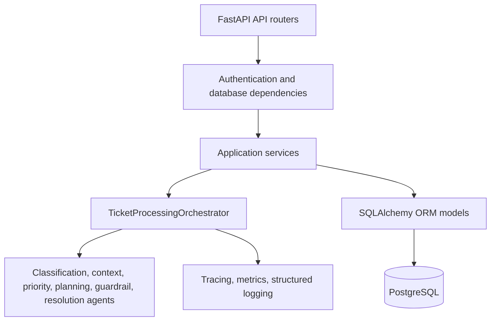
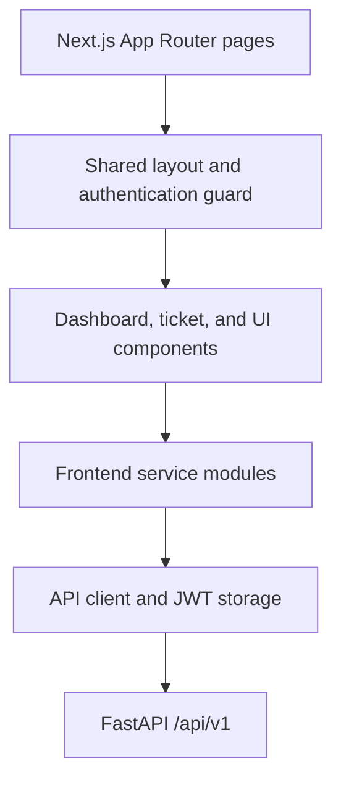
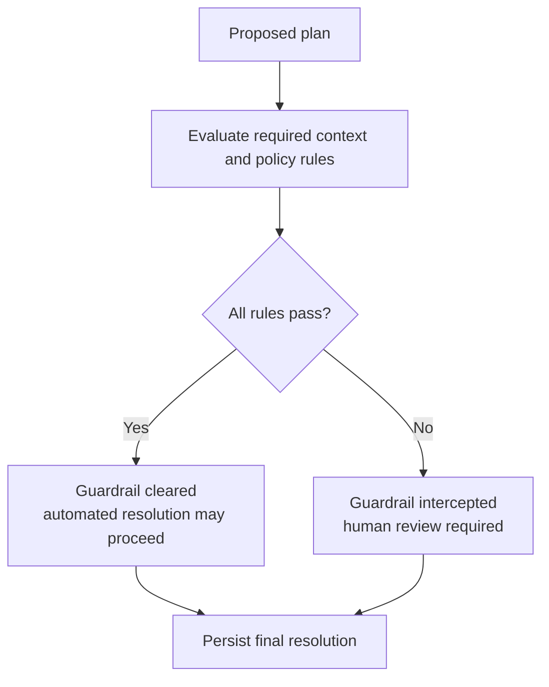
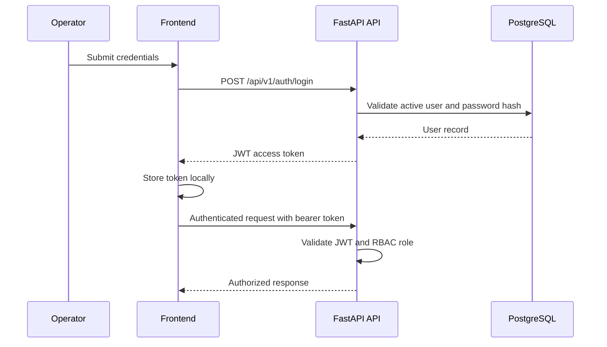

# ACRA architecture

ACRA is a layered support-operations application. The frontend remains responsible for operator interaction; the backend owns authentication, persistence, deterministic processing, and response contracts.

## Backend layers

- **API routers** expose versioned HTTP endpoints and map request and response schemas.
- **Dependencies** resolve authenticated users, role requirements, and async database sessions.
- **Services** contain application workflows and persistence boundaries.
- **Orchestrator and agents** execute the established ticket-processing sequence.
- **Models and migrations** maintain PostgreSQL schema and persisted entities.
- **Observability** attaches correlation, metrics, and structured events to processing runs.

## Frontend layers

- **Routes** compose dashboard, login, and ticket-detail screens.
- **Layout and auth guard** protect operator routes and direct unauthenticated users to login.
- **Components** render the control-room experience and manage local interaction state.
- **Service modules** provide typed API operations.
- **API client** attaches the stored bearer token and turns failed responses into typed errors.

## End-to-end AI processing pipeline

```mermaid
flowchart LR
    Start["Operator processes ticket"] --> Auth["JWT and RBAC check"]
    Auth --> Load["Load ticket and related context"]
    Load --> Classify["Classification\nsentiment and intent"]
    Classify --> Context["Context retrieval\ncustomer, account, order"]
    Context --> Priority["Priority\nscore and lane"]
    Priority --> Plan["Planning\naction and confidence"]
    Plan --> Guardrail["Guardrail evaluation\ndeterministic rules"]
    Guardrail --> Resolution["Resolution\nautomated or human review"]
    Resolution --> Persist["Persist resolution"]
    Persist --> Response["Structured API response"]
```

## Guardrail flow

Guardrails are deterministic checks independent of model confidence. Their result controls whether the final resolution is automated or marked for human review.

## Authentication flow

The browser stores the bearer token locally. The authentication guard verifies the current user with the backend before rendering protected operator pages.
