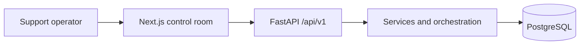

# ACRA

Autonomous Customer Resolution Agent is an AI operations console for authenticated support teams. It combines a FastAPI backend, deterministic multi-agent ticket processing, PostgreSQL persistence, and a Next.js control room for reviewing and resolving customer tickets.

## Project status

**ACRA v1.0.0 is production-ready.** The release includes containerized local development, automated frontend and backend testing, deployment guidance, authentication and RBAC, observability, and a polished operator interface.

## Key features

- Authenticated operator console with JWT-based access control and role-based authorization.
- Live ticket queue and ticket detail views backed by the FastAPI API.
- Deterministic AI processing pipeline for classification, priority, planning, guardrails, and resolution.
- Persisted resolutions with guardrail outcomes and human-review escalation.
- Structured logging, correlation tracing, and in-memory pipeline metrics.
- Responsive control-room UI with skeleton loading, processing feedback, guardrail stamps, and toast notifications.
- Local Docker Compose stack plus provider-neutral production deployment guidance.

## Architecture overview

ACRA separates the browser experience, API/service layers, processing pipeline, and PostgreSQL persistence. The frontend communicates only with versioned API endpoints; the backend coordinates agents and safeguards through the existing orchestration flow.



See [ARCHITECTURE.md](ARCHITECTURE.md) for the complete layer, processing, guardrail, and authentication diagrams.

## AI pipeline

Each ticket-processing request follows the established agent flow:

1. Classification determines sentiment and intent.
2. Context retrieval assembles customer, account, order, and ticket context.
3. Priority evaluates urgency and the service lane.
4. Planning selects the proposed action and confidence.
5. Guardrails evaluate deterministic policy rules.
6. Resolution produces the final outcome, either automated or human-review required.

## Frontend overview

The Next.js App Router frontend provides the dashboard, login flow, ticket queue, ticket detail view, processing feedback, and guardrail visualization. It uses IBM Plex typography, CSS design tokens, Tailwind utilities, and a lightweight toast layer while retaining the existing API client and JWT storage behavior.

## Tech stack

| Area | Technology |
| --- | --- |
| Frontend | Next.js App Router, React, TypeScript, Tailwind CSS, Sonner |
| Backend | FastAPI, Python, Pydantic Settings |
| Persistence | PostgreSQL, async SQLAlchemy, Alembic, asyncpg |
| Security | JWT, Argon2 password hashing, RBAC |
| Testing | Pytest, pytest-asyncio, Vitest, Testing Library |
| Local runtime | Docker Compose |

## Folder structure

```text
ACRA/
├── backend/                 FastAPI application, migrations, and backend tests
├── frontend/                Next.js operator console and component tests
├── docker-compose.yml       Local multi-service stack
├── ARCHITECTURE.md          System design and Mermaid diagrams
├── DEPLOYMENT.md            Production deployment runbook
├── DOCKER.md                Local Docker Compose guide
├── RELEASE.md               Release checklist
└── TESTING.md               Test-suite guide
```

## Installation

Prerequisites:

- Python 3.12+
- Node.js 22+
- PostgreSQL 16+ for direct local development, or Docker Desktop for the containerized stack

Install the backend dependencies:

```bash
cd backend
python -m pip install -r requirements.txt
```

Install the frontend dependencies:

```bash
cd frontend
npm ci
```

## Local development

Create local environment files from the provided examples:

```powershell
Copy-Item backend/.env.example backend/.env
Copy-Item frontend/.env.example frontend/.env.local
```

Start the backend from `backend/`:

```bash
uvicorn app.main:app --reload --host 127.0.0.1 --port 8000
```

Start the frontend from `frontend/`:

```bash
npm run dev
```

The frontend is available at `http://localhost:3000`; the backend API is available at `http://127.0.0.1:8000`.

## Docker

Use Docker Compose for the complete local stack:

```powershell
Copy-Item .env.example .env
docker compose up --build
```

See [DOCKER.md](DOCKER.md) for configuration, verification, and shutdown instructions.

## Testing

The backend integration suite uses a dedicated disposable PostgreSQL database. The frontend suite uses Vitest and Testing Library.

```powershell
cd frontend
npm test
```

See [TESTING.md](TESTING.md) for complete backend and frontend test instructions.

## Deployment

ACRA supports a managed PostgreSQL database, a Docker-hosted backend on Railway or Render, and a Vercel-hosted frontend. Deployment is provider-neutral and configured entirely through environment variables.

See [DEPLOYMENT.md](DEPLOYMENT.md) for required variables, migrations, release steps, production verification, and rollback guidance.

## Demo walkthrough

1. Start the Docker Compose stack or the local backend and frontend services.
2. Sign in with the configured bootstrap administrator credentials.
3. Open the dashboard and select a ticket from a priority lane.
4. Review the ticket context and choose **Process Ticket**.
5. Follow the visual processing progress indicator.
6. Review the classification, priority, guardrail result, and persisted resolution.
7. Use an eligible refund ticket to demonstrate a cleared guardrail, then a high-value refund ticket to demonstrate human-review interception.

## Screenshots

Add release screenshots here before publishing the repository:

- `docs/screenshots/dashboard.png` — dashboard priority lanes
- `docs/screenshots/ticket-detail.png` — ticket processing result
- `docs/screenshots/guardrail-intercepted.png` — human-review guardrail state

## Future roadmap

- Exportable operational reporting.
- Configurable policy-rule administration.
- Broader automated end-to-end browser coverage.
- Optional external observability exporters.

## License

License to be selected before public distribution.

## Author

ACRA is maintained by the project author and contributors.

## Further reading

- [Architecture](ARCHITECTURE.md)
- [Testing](TESTING.md)
- [Docker Compose](DOCKER.md)
- [Deployment](DEPLOYMENT.md)
- [Release checklist](RELEASE.md)
